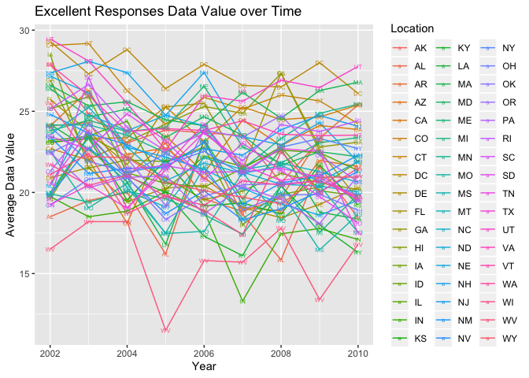

p8105\_hw3\_sl4662
================

# Problem 1

``` r
data("instacart")

nrow(distinct(instacart,aisle_id))  # total number of aisles 
```

    ## [1] 134

``` r
instacart %>% 
group_by(aisle) %>% 
summarize(n = n()) %>% 
filter(min_rank(desc(n))<2) # filter out only when rank = 1 (max)
```

    ## # A tibble: 1 x 2
    ##   aisle                 n
    ##   <chr>             <int>
    ## 1 fresh vegetables 150609

``` r
# mutate(ranking = min_rank(desc(n))) %>%  # rank aisle in max to min order
```

There are 134 aisles, and the most popular is fresh vegetables.

``` r
aisle_count =
  instacart %>% 
  group_by(aisle) %>% 
  summarize(n = n()) %>% 
  filter(n > 10000) # aisles with more than 10000 items ordered
  
ggplot(aisle_count, aes(x = n, y = reorder(aisle, n))) +
  geom_point(aes(color = aisle), alpha = .5) +  
  scale_color_hue(h = c(300, 600)) +
  scale_x_continuous(
    breaks = c(10000, 20000, 40000, 80000, 150000)
    ) +
    theme(legend.position = "none", axis.text.x = element_text(angle = 45)) +
  labs(
    title = "Aisle Data",
    x = "Number ordered",
    y = "Aisle Types"
  )
```

<!-- -->

The most popular is fresh vegatibles. The second popular is fresh
fruits. Both fresh vegatables and fruits are ordered aound 150000 times.
The third popular is packaged vegatibles fruits, which is ordered around
80000 times.

``` r
baking=
  instacart %>%
  filter(aisle == "baking ingredients") %>% 
  count(product_name, aisle_name ="baking ingredients")  %>% 
  arrange(desc(n)) %>% 
  head(3)


dog = 
  instacart %>%
  filter(aisle == "dog food care") %>%
  count(product_name, aisle_name ="dog_food_care") %>% 
  arrange(desc(n)) %>% 
  head(3)


vegetables = 
  instacart %>%
  filter(aisle == "packaged vegetables fruits") %>%
  count(product_name, aisle_name ="packaged vegetables fruits") %>% 
  arrange(desc(n)) %>% 
  head(3)


three = bind_rows(baking, dog, vegetables) %>% 
  select(aisle_name, product_name, n) %>% 
  rename(., number_of_orders = n)
  
knitr::kable(three)
```

| aisle\_name                | product\_name                                 | number\_of\_orders |
| :------------------------- | :-------------------------------------------- | -----------------: |
| baking ingredients         | Light Brown Sugar                             |                499 |
| baking ingredients         | Pure Baking Soda                              |                387 |
| baking ingredients         | Cane Sugar                                    |                336 |
| dog\_food\_care            | Snack Sticks Chicken & Rice Recipe Dog Treats |                 30 |
| dog\_food\_care            | Organix Chicken & Brown Rice Recipe           |                 28 |
| dog\_food\_care            | Small Dog Biscuits                            |                 26 |
| packaged vegetables fruits | Organic Baby Spinach                          |               9784 |
| packaged vegetables fruits | Organic Raspberries                           |               5546 |
| packaged vegetables fruits | Organic Blueberries                           |               4966 |

The most popular product in baking ingredients aisle is light brown
sugar.

The most popular product in dog food care is snack sticks chicken & rice
recipe dog treats.

The most popular product in packaged vegetables fruits is orgainic baby
spinach. The top three popular products in packaged vegetables fruits
are all orgainic products.

``` r
apple =
  instacart %>%
  filter(product_name == "Pink Lady Apples") %>% 
  select(order_dow, order_hour_of_day, product_name) %>% 
  arrange(order_dow)

apple_weekday = 
  apple %>% 
  group_by(order_dow) %>%
  summarize(apple_mean_weight = mean(order_hour_of_day))

coffee =
  instacart %>%
  filter(product_name == "Coffee Ice Cream") %>% 
  select(order_dow, order_hour_of_day, product_name) %>% 
  arrange(order_dow)

coffee_weekday = 
  coffee %>% 
  group_by(order_dow) %>%
  summarize(coffee_mean_weight = mean(order_hour_of_day))

apple_weekday = pivot_wider(
  apple_weekday, 
  names_from = "order_dow", 
  values_from = "apple_mean_weight") 

apple_weekday = mutate(apple_weekday,type = "apple")

coffee_weekday = pivot_wider(
  coffee_weekday, 
  names_from = "order_dow", 
  values_from = "coffee_mean_weight")

coffee_weekday = mutate(coffee_weekday,type = "coffee")

apple_coffee = bind_rows(apple_weekday, coffee_weekday)

apple_coffee =
  apple_coffee %>% 
    select(type, everything()) %>% 
  mutate(
    type = recode(type, apple = "Pink Lady Apples", 
                      coffee = "Coffee Ice Cream")) %>% 
  rename(., Sunday = "0", Monday = "1", Tuesday = "2", Wednesday = "3", Thursday = "4", Friday = "5", Saturday = "6") 

knitr::kable(apple_coffee)
```

| type             |   Sunday |   Monday |  Tuesday | Wednesday | Thursday |   Friday | Saturday |
| :--------------- | -------: | -------: | -------: | --------: | -------: | -------: | -------: |
| Pink Lady Apples | 13.44118 | 11.36000 | 11.70213 |  14.25000 | 11.55172 | 12.78431 | 11.93750 |
| Coffee Ice Cream | 13.77419 | 14.31579 | 15.38095 |  15.31818 | 15.21739 | 12.26316 | 13.83333 |

Both orders of pink lady apples and coffee ice cream are placed around
noon to 3pm.

There are 15 variables in instacart data set, and 1384617 observations.
This data set is based on each item from different orders and different
times. For example, we can look at the first row. Bulgarian Yogurt has
product id 49302, it is in order 1, and it is added to the cart first.
It is the forth order being placed by user 112108 on Thursday. It has
been 9 days since this user’s prior order. This product belongs to aisle
yogurt and department dairy eggs.

# Problem 2

``` r
data("brfss_smart2010") 

brfss = 
  brfss_smart2010 %>% 
  janitor::clean_names() %>% 
  filter(topic == "Overall Health") %>% 
  drop_na(response) %>% 
  mutate(response = factor(response, levels = c("Poor", "Fair", "Good", "Very good", "Excellent"))) %>% 
  arrange(response)

location_2002 = 
  brfss %>% 
  filter(year == "2002") %>% 
  distinct(locationdesc) %>% 
  separate(locationdesc, into = c("state", "location"), sep="-") %>% 
  count(state) %>% 
  filter(n > 6) 

location_2010 = 
  brfss %>% 
  filter(year == "2010") %>% 
  distinct(locationdesc) %>% 
  separate(locationdesc, into = c("state", "location"), sep="-") %>% 
  count(state) %>% 
  filter(n > 6)
```

In 2002, CT , FL , MA , NC , NJ , PA were observed at 7 or more
locations.

In 2010, CA , CO , FL , MA , MD , NC , NE , NJ , NY , OH , PA , SC , TX
, WA were observed at 7 or more locations.

More locations among states are being observed in 2010 compare to 2002.

``` r
plot_data = 
  brfss %>% 
  filter(response == "Excellent") %>% 
  select(year, locationabbr, response, data_value) %>% 
  drop_na() %>% 
  group_by(year, locationabbr) %>% 
  summarise(mean_data_value = mean(data_value))
  
ggplot(data = plot_data, aes(x = year, y = mean_data_value, color = locationabbr)) + 
  geom_line(aes(group = locationabbr)) +
  geom_text(aes(label = locationabbr),
            size = 2) +
  theme(legend.position = "right") +
  labs(
    color = "Location",
    title = "Excellent Responses Data Value over Time",
    x = "Year",
    y = "Average Data Value")
```

<!-- -->

State WV has the lowest average data value among all sates. Overall, the
average data value decreased a little from year 2002 to 2010.

``` r
two_panel_data = 
  brfss %>% 
  filter(year == "2006"|year == "2010") %>% 
  filter(locationabbr == "NY") %>% 
  select(year, locationabbr, locationdesc, response, data_value) %>% 
  drop_na() 

ggplot(data = two_panel_data, aes(x = response, y = data_value, color = locationdesc)) + 
  geom_point() +
  geom_text(aes(label = locationdesc),
            size = 2) +
  facet_grid(. ~ year) +
  theme(legend.position = "bottom", axis.text.x = element_text(angle = 45)) +
  labs(
    color = "Location",
    title = "2006 and 2010 Distribution of Data Value in NY State",
    x = "Response",
    y = "Data Value"
  )
```

<!-- -->

The distribution for poor response is the lowest among other responses.
Fair response has higher data values than poor response, but still low
compare to the other three responses. Good, very good and excellent have
similar data values.

# Problem 3

``` r
accel = 
  read_csv("accel_data.csv") %>% 
  janitor::clean_names() %>%
  mutate(weekday = TRUE) %>% 
  select(week, day_id, day, weekday, everything()) %>% 
  mutate(weekday = replace(weekday, day == "Saturday"|day == "Sunday", FALSE))
```

    ## Parsed with column specification:
    ## cols(
    ##   .default = col_double(),
    ##   day = col_character()
    ## )

    ## See spec(...) for full column specifications.

In the Accelerometers dataset, we have a total of 35 obervations, and
1444 variables.

`activity.*` for every minutes are numeric variables.

`weekday` is logical variables. If `1`, then it is a weekday. If `0`,
then is is a weekend.

`day` is character variables. It contains `Monday` to `Sunday`.

`day id`is numeric variables. It represents the number of days.

`week` is numeric variables. It represents the numebr of weeks.

``` r
daily_activity = 
  accel %>% 
  mutate(activity_total = rowSums(.[5:1444])) %>% 
  select(week, day_id, day, weekday, activity_total)

knitr::kable(daily_activity)
```

| week | day\_id | day       | weekday | activity\_total |
| ---: | ------: | :-------- | :------ | --------------: |
|    1 |       1 | Friday    | TRUE    |       480542.62 |
|    1 |       2 | Monday    | TRUE    |        78828.07 |
|    1 |       3 | Saturday  | FALSE   |       376254.00 |
|    1 |       4 | Sunday    | FALSE   |       631105.00 |
|    1 |       5 | Thursday  | TRUE    |       355923.64 |
|    1 |       6 | Tuesday   | TRUE    |       307094.24 |
|    1 |       7 | Wednesday | TRUE    |       340115.01 |
|    2 |       8 | Friday    | TRUE    |       568839.00 |
|    2 |       9 | Monday    | TRUE    |       295431.00 |
|    2 |      10 | Saturday  | FALSE   |       607175.00 |
|    2 |      11 | Sunday    | FALSE   |       422018.00 |
|    2 |      12 | Thursday  | TRUE    |       474048.00 |
|    2 |      13 | Tuesday   | TRUE    |       423245.00 |
|    2 |      14 | Wednesday | TRUE    |       440962.00 |
|    3 |      15 | Friday    | TRUE    |       467420.00 |
|    3 |      16 | Monday    | TRUE    |       685910.00 |
|    3 |      17 | Saturday  | FALSE   |       382928.00 |
|    3 |      18 | Sunday    | FALSE   |       467052.00 |
|    3 |      19 | Thursday  | TRUE    |       371230.00 |
|    3 |      20 | Tuesday   | TRUE    |       381507.00 |
|    3 |      21 | Wednesday | TRUE    |       468869.00 |
|    4 |      22 | Friday    | TRUE    |       154049.00 |
|    4 |      23 | Monday    | TRUE    |       409450.00 |
|    4 |      24 | Saturday  | FALSE   |         1440.00 |
|    4 |      25 | Sunday    | FALSE   |       260617.00 |
|    4 |      26 | Thursday  | TRUE    |       340291.00 |
|    4 |      27 | Tuesday   | TRUE    |       319568.00 |
|    4 |      28 | Wednesday | TRUE    |       434460.00 |
|    5 |      29 | Friday    | TRUE    |       620860.00 |
|    5 |      30 | Monday    | TRUE    |       389080.00 |
|    5 |      31 | Saturday  | FALSE   |         1440.00 |
|    5 |      32 | Sunday    | FALSE   |       138421.00 |
|    5 |      33 | Thursday  | TRUE    |       549658.00 |
|    5 |      34 | Tuesday   | TRUE    |       367824.00 |
|    5 |      35 | Wednesday | TRUE    |       445366.00 |

Since there are two many data here, it is hard to see any trend. I
furthur organized data using week number, weekday vs weekend and 7
weekdays parameters to get a clearer view.

``` r
monday_to_sunday_activity =
  daily_activity %>% 
  group_by(day) %>% 
  summarize(daily_mean_activity = mean(activity_total))

knitr::kable(monday_to_sunday_activity)
```

| day       | daily\_mean\_activity |
| :-------- | --------------------: |
| Friday    |              458342.1 |
| Monday    |              371739.8 |
| Saturday  |              273847.4 |
| Sunday    |              383842.6 |
| Thursday  |              418230.1 |
| Tuesday   |              359847.6 |
| Wednesday |              425954.4 |

``` r
weekend_activity = 
  daily_activity %>% 
  group_by(weekday) %>% 
  summarize(weekday_weekend_mean_activity = mean(activity_total))

knitr::kable(weekend_activity)
```

| weekday | weekday\_weekend\_mean\_activity |
| :------ | -------------------------------: |
| FALSE   |                         328845.0 |
| TRUE    |                         406822.8 |

``` r
weekly_activity = 
  daily_activity %>% 
  group_by(week) %>% 
  summarize(weekly_mean_activity = mean(activity_total))

knitr::kable(weekly_activity)
```

| week | weekly\_mean\_activity |
| ---: | ---------------------: |
|    1 |               367123.2 |
|    2 |               461674.0 |
|    3 |               460702.3 |
|    4 |               274267.9 |
|    5 |               358949.9 |

We can tell from the tables that this person has more activity on the
weekdays compare to the weekends. In addition, there is very little
activity during week 4 compare to week 1, 2, 3 and 5. Activities are
highest during week 2 and 3.

``` r
accel_plot = 
  pivot_longer(
    accel, 
    activity_1:activity_1440,
    names_to = "min_day", 
    values_to = "activity") %>% 
  separate(min_day, into = c("n", "min"), sep="_") 

accel_plot$min = as.numeric(accel_plot$min)

  


ggplot(data = accel_plot, aes(x = min, y = activity, color = day)) + 
  geom_line(aes(group = day_id), alpha = .1) +
  geom_smooth(se = FALSE) +
  theme(legend.position = "bottom") +
  scale_color_hue(h = c(100, 900)) +
  labs(
    color = "Day of Week",
    title = "Daily Activity",
    x = "Minutes",
    y = "Activity") +
  scale_x_continuous(
    breaks = c(0, 480, 720, 1020, 1260), 
    labels = c("12am", "8am", "12pm", "5pm", "9pm"))
```

    ## `geom_smooth()` using method = 'gam' and formula 'y ~ s(x, bs = "cs")'

<!-- -->

From the plot, we can see that this person is generally more active on
Friday nights around 9pm and Sunday Mornings around 11am. There is
almost no activity from midnight to the morning, which means this person
is resting from 12am to 7am.
